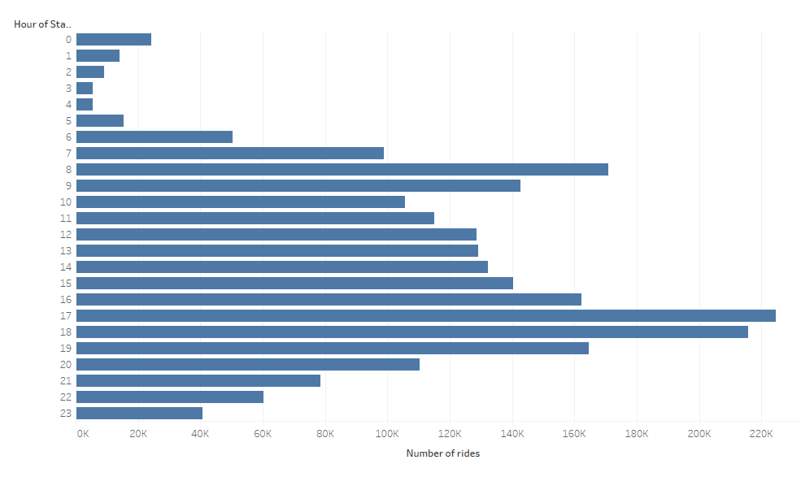
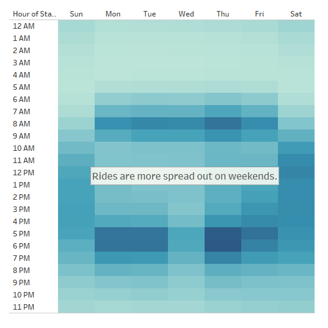
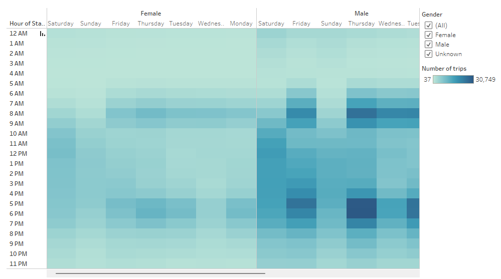
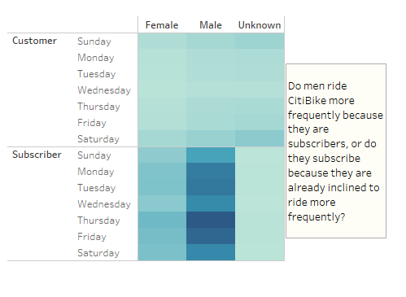

# CitiBike ride trends in New York City, August 2019

## Overview of the analysis
This analysis uses publicly available CitiBike data from August 2019 to examine bikesharing trends in New York City. Among the available data points are number of rides, 
the starting and stopping times and locations for each ride, and user data. The user data includes age and gender of user, as well as whether they are a CitiBike 
subscriber or a more casual customer. For this analysis, we focused on starting times, trip duration, user gender and user type.

We used Tableau to illustrate some of the insights derived from these data points.

## Results
Our analysis shows that most CitiBike trips are very short, typically lasting less than 20 minutes, with roughly 5 minutes being the most common trip duration.

Looking at this data by gender shows a similar trend, with both men and women mostly riding for less than 10 minutes. There is a small amount of data for people whose 
gender is unknown, but it is not clear whether CitiBike allows for gender categories other than man and woman when collecting user data.

Looking at the data by time of trip initiation shows that while rides occur at all hours of the day and night, they tend to peak on weekdays around 8 to 9 am and then again around 5 to 6 pm. On weekends, trips are more spread out during daylight hours. Both men and women appear to use CitiBike most frequently during morning and 
evening rush hour.

More than three-quarters of CitiBike rides are taken by subscribers rather than more casual customers, and most CitiBike subscribers are men. 

## Summary
CitiBikes are in highest demand during typical rush-hour periods, and rides tend to be very short in duration. Men are the biggest CitiBike customers and make up 
most of the service's subscriber base.

It would be worthwhile to create a map showing trip timing relative to trip location. This could help inform decisions about where to concentrate bike placement at 
certain times of day, in order to adequately meet demand. 

Another useful map could look at the locations where subscribers and other customers are most likely to start their trips. If CitiBike wants to convince more 
customers to become official subscribers, it should make sure that enough bikes are available to them at in-demand times and locations.
